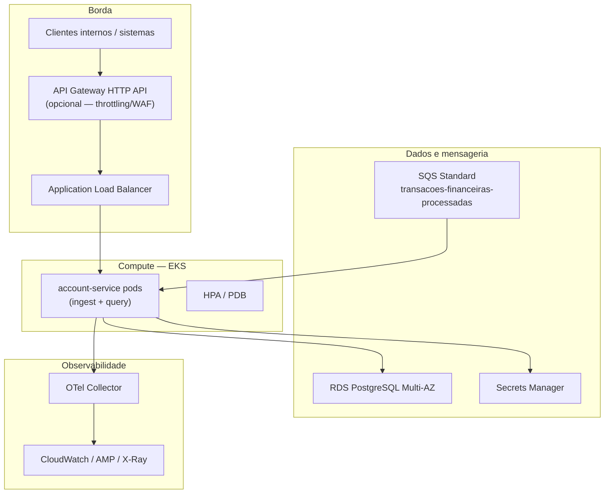
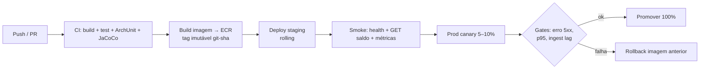

# Arquitetura AWS e pipeline de deploy

Documento de proposta para implantar o **account-service** em AWS com mitigação de risco de regressão que impacte todos os clientes.

---

## 1. Objetivos da topologia

- Disponibilidade da consulta de saldo e da ingestão SQS.
- Isolamento de falhas (rede, banco, deploy).
- Observabilidade e rollback rápido.
- Segredo e identidade *least privilege* (IRSA).

Alinhado a [ADR-010](../specs/001-account-balance-query/adr/ADR-010.md) e [ADR-011](../specs/001-account-balance-query/adr/ADR-011.md).

---

## 2. Visão da arquitetura (produção)

### 2.1 Componentes e papéis

| Componente | Escolha proposta | Função |
|------------|------------------|--------|
| **Orquestrador** | **Amazon EKS** | Deploy, scaling, rolling/canary |
| **Compute** | Pods no EKS (imagem JRE 25, non-root) | Serviço único ingest+query |
| **Load balancer** | **ALB** via AWS Load Balancer Controller | L7, health checks → readiness |
| **API Gateway** | **Opcional** na frente do ALB | AuthN no edge, WAF, throttle, API keys — *não* obrigatório se a rede já for privada institucional |
| **Mensageria** | **SQS Standard** | Fonte de eventos; DLQ de broker opcional (fora do escopo atual do app) |
| **Banco** | **RDS PostgreSQL Multi-AZ** | SoR do snapshot/journal |
| **Segredos** | **Secrets Manager** + IRSA | DB URL/credenciais sem secret em plaintext no manifesto |
| **Imagens** | **ECR** | Artefato versionado |
| **DNS/TLS** | Route 53 + ACM (se exposição interna/pública) | TLS no ALB |
| **Rede** | VPC privada, SGs mínimos | App → RDS/SQS apenas |

### 2.2 Por que EKS (e não só ECS/Lambda)

| Opção | Prós | Contras neste contexto |
|-------|------|------------------------|
| **EKS** | Rolling/canary maduro, PDB, alinhado ADR-010 | Custo de controle plane |
| ECS Fargate | Mais simples ops | Canary/análise de tráfego menos flexível |
| Lambda + SQS | Escala evento a evento | Conexões JDBC/Hikari e p95 de query stateful são piores encaixes; cold start |

**Decisão:** EKS com orçamento de conexões (`replicas × Hikari ≤ max_connections − reserva`) — [ADR-007](../specs/001-account-balance-query/adr/ADR-007.md).

### 2.3 API Gateway: usar ou não?

- **Usar** se precisar de auth centralizada, WAF, quotas por consumidor ou contrato externo.
- **Omitir** (tráfego só ALB privado) se o perímetro já autentica na malha institucional — reduz hop e complexidade (posição do plano do desafio).

---

## 3. Health e tráfego

| Probe | Endpoint | Uso |
|-------|----------|-----|
| Liveness | `/actuator/health/liveness` | Reinicia pod travado |
| Readiness | `/actuator/health/readiness` (**inclui DB**) | Remove do ALB se Postgres indisponível |
| Startup | (opcional) | Evita kill durante Flyway/warm-up |

O ALB **só** deve encaminhar tráfego a pods *Ready*. Assim um deploy com migração/DB ruim não recebe 100% das consultas imediatamente.

---

## 4. Pipeline CI/CD proposto

### 4.1 Etapas

1. **CI (a cada PR)**  
   - `mvn verify` (testes + JaCoCo).  
   - ArchUnit (limites Clean Architecture).  
   - (Opcional) scan CVE da imagem.

2. **Build de artefato**  
   - Dockerfile em `deploy/docker/Dockerfile`.  
   - Tag: `account-service:<git-sha>` (nunca `latest` em prod).

3. **Staging**  
   - RDS/SQS de não-produção.  
   - Flyway no boot; smoke HTTP + consumo controlado.

4. **Produção — mitigação de bug “quebra todos os clientes”**  
   Estratégia em camadas ([ADR-011](../specs/001-account-balance-query/adr/ADR-011.md)):

   | Camada | Mecanismo | O que mitiga |
   |--------|-----------|--------------|
   | A | **Canary** (5–10% pods / weight no ALB) | Bug de lógica/consulta afeta fração do tráfego |
   | B | **Readiness com DB** | Pods sem Postgres não entram no ALB |
   | C | **Gates automáticos** (5xx↑, p95↑, `ingestion.retries`↑) | Aborta promoção |
   | D | **Rollback** para ReplicaSet/imagem anterior | RTO curto |
   | E | **PDB** + maxUnavailable limitado | Evita derrubar todo o Deployment de uma vez |
   | F | Feature flag / `SQS_ENABLED` | Congela ingestão sem derrubar consulta, se necessário |

5. **Pós-deploy**  
   - Dashboards: latência HTTP, outcomes de ingestão, Hikari, idade do saldo retornado.  
   - Alarmes CloudWatch em erro e saturação de fila.

### 4.2 Migrações Flyway em produção

- Preferir migrações **compatíveis com versão anterior** (expand/contract) para canary seguro.
- Evitar *lock* longo em tabelas quentes durante o rolling.
- Se migração for breaking: janela controlada + freeze de deploy + runbook.

---

## 5. Dimensionamento inicial (referência)

| Recurso | Ponto de partida |
|---------|------------------|
| Replicas | 3 (mín. HA) |
| HPA | CPU / RPS / custom (lag SQS se disponível) |
| Hikari `maximum-pool-size` | 20 (validar vs. `max_connections`) |
| `SQS_MAX_CONCURRENT` | ≤ pool (ex.: 16) |
| RDS | Multi-AZ, storage GP3, backups automáticos |

---

## 6. Segurança (mínimo)

- IRSA: permissões só `sqs:ReceiveMessage/DeleteMessage/ChangeMessageVisibility` na fila do serviço; Secrets Manager read.
- Sem *access key* de longo prazo no pod.
- NetworkPolicy / SG: app → 5432 RDS e endpoints SQS; sem SSH público.
- Endpoints `/internal/journal/**` atrás de auth forte (hoje *deny-by-default* — ver [Design Doc](design-doc.md) §3.1).

---

## 7. Local vs produção

| Local | Produção |
|-------|----------|
| Compose + LocalStack | SQS real |
| Postgres container | RDS Multi-AZ |
| `AWS_ENDPOINT_OVERRIDE` | Sem override |
| OTel opcional | Collector + backend corporativo |

Manifesto de referência: `deploy/k8s/account-service.yaml`.

---

## 8. Referências

- [Design Doc](design-doc.md)
- [ADR-007](../specs/001-account-balance-query/adr/ADR-007.md) — conexões
- [ADR-010](../specs/001-account-balance-query/adr/ADR-010.md) — topologia EKS/RDS
- [ADR-011](../specs/001-account-balance-query/adr/ADR-011.md) — progressive delivery
