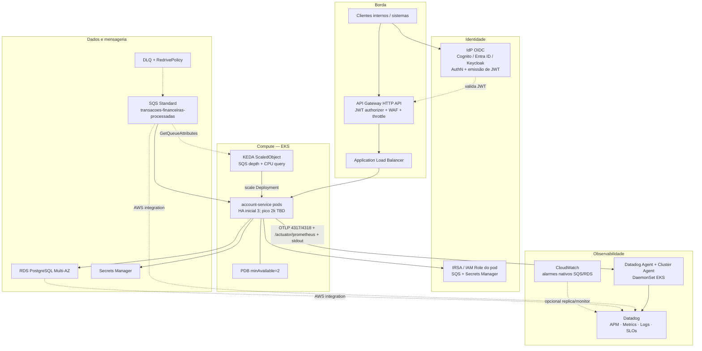
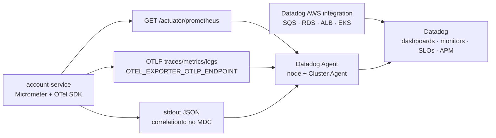
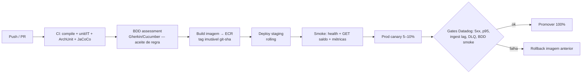
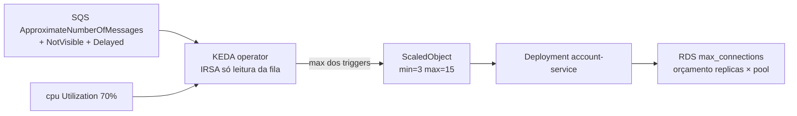

# Arquitetura AWS e pipeline de deploy

Documento de proposta para implantar o **account-service** em AWS com mitigação de risco de regressão que impacte todos os clientes.

**Última atualização:** 2026-08-05 — KEDA (SQS), **Datadog**; capacidade local ~300 EPS/instância → piso **7** réplicas para 2k EPS ([§5](#5-dimensionamento-pico-2k-msgs--piso-local)).

---

## 1. Objetivos da topologia

- Disponibilidade da consulta de saldo e da ingestão SQS.
- Isolamento de falhas (rede, banco, deploy, identidade).
- Observabilidade e rollback rápido.
- Segredo e identidade *least privilege* (IRSA para AWS; **IdP OIDC** para AuthN/AuthZ de chamadores).
- Capacidade de pico ≥ **2.000 eventos/s** a **comprovar** em EKS/RDS (diagnóstico local ≠ sizing).

---

## 2. Visão da arquitetura (produção)



O **IdP não está implementado no MVP**, mas **faz parte da solução**. Sem ele não há AuthN/AuthZ confiável para `GET /balances/**` nem para `/internal/journal/**`.

### 2.1 Componentes e papéis

| Componente | Escolha proposta | Função | Motivação |
| --- | --- | --- | --- |
| **IdP** | **OIDC** (Cognito, Entra ID, Keycloak corporativo) | AuthN de usuários/sistemas; emite JWT com papéis | Conta é dado sensível; RBAC (consulta vs journal vs replay) exige identidade forte |
| **API Gateway** | HTTP API + JWT authorizer | Valida token **antes** do pod; WAF; throttle | Falha de auth não consome JDBC; perímetro único |
| **Orquestrador** | **Amazon EKS** | Deploy, scaling, rolling/canary | PDB + canary maduros para serviço crítico |
| **Autoscaling** | **KEDA** (`aws-sqs-queue`) + trigger CPU auxiliar | Scale-out quando a fila cresce; CPU só para pico de consulta | Profundidade SQS ≠ utilização de CPU (I/O JDBC, virtual threads, long-poll) |
| **Compute** | Pods no EKS (JRE 25, non-root) | Ingest + query no mesmo Deployment | Um processo, duas portas de carga; escala por réplica |
| **Load balancer** | **ALB** | L7, health → readiness | Só pods Ready recebem consulta |
| **Mensageria** | **SQS Standard** + **DLQ** | Fonte + isolamento poison | At-least-once explícito; recovery IAM separado |
| **Banco** | **RDS PostgreSQL Multi-AZ** | SoR snapshot/journal | ACID + índices únicos parciais |
| **Segredos** | **Secrets Manager** + IRSA | DB sem secret em plaintext | Sem access key de longo prazo no pod |
| **Imagens** | **ECR** | Artefato imutável `git-sha` | Rollback determinístico |
| **DNS/TLS** | Route 53 + ACM | TLS no ALB / Gateway | Tráfego interno cifrado |
| **Rede** | VPC privada, SGs mínimos | App → RDS/SQS apenas | Superfície de ataque reduzida |
| **Observabilidade** | **Datadog** (Agent + Cluster Agent + AWS integration) | APM, métricas Micrometer, logs, SLOs, canary gates | Correlação ingestão↔consulta↔SQS/RDS; CPU HPA sozinho não opera o serviço |
| **Alarmes AWS** | **CloudWatch** (Terraform) | DLQ visível, idade DLQ ≥ 12 d, idade da fonte | Backup nativo se o Agent/Datadog falhar; FR de broker |

IRSA ≠ IdP: o pod autentica-se na **AWS**; o chamador HTTP autentica-se no **IdP**. Os dois são necessários.

### 2.2 Por que EKS (e não só ECS/Lambda)

| Opção | Prós | Contras neste contexto | Motivação da escolha |
| --- | --- | --- | --- |
| **EKS** | Rolling/canary, PDB, KEDA (lag SQS) | Custo de control plane | Serviço núcleo precisa de promoção gradual e minAvailable |
| ECS Fargate | Ops mais simples | Canary/análise de tráfego menos flexível | — |
| Lambda + SQS | Escala evento a evento | JDBC/Hikari + p95 stateful ruins; cold start | Snapshot + pool persistente não encaixa |

**Decisão:** EKS com orçamento de conexões (`replicas × Hikari ≤ max_connections − reserva`). Ex.: 3 réplicas × pool 40 = 120 conexões de app — dimensionar RDS com folga (autovacuum, admin, monitoring). O teto sobe com o **KEDA** (`maxReplicaCount`); validar RDS **antes** de subir o max.

### 2.3 API Gateway + IdP: usar

- **Usar** na solução-alvo: auth centralizada, WAF, quotas por consumidor, JWT authorizer.
- O MVP do desafio omite o hop (tráfego direto no ALB/local) **apenas por escopo**; a documentação de produção **não** trata IdP como opcional.

Papéis típicos no token:

| Papel | Escopo |
| --- | --- |
| `balance.read` | `GET /balances/{accountId}` |
| `journal.read` | `GET /internal/journal/**` |
| `journal.replay` | `POST /internal/journal/replay` (quando implementado) |
| `ops.redrive` | Fora do app — CLI/job com IAM de recovery SQS |

---

## 3. Health, tráfego e observabilidade

| Probe | Endpoint | Uso |
| --- | --- | --- |
| Liveness | `/actuator/health/liveness` | Reinicia pod travado |
| Readiness | `/actuator/health/readiness` (**DB + `sqsTopology`** se ingestão on) | Remove do ALB se Postgres ou topologia SQS (modo enforce) inválida |
| Startup | `/actuator/health` | Evita kill durante Flyway/warm-up |

O ALB **só** deve encaminhar tráfego a pods *Ready*. Assim um deploy com migração/DB ruim não recebe 100% das consultas imediatamente.

### 3.1 Datadog (produção)

O MVP já emite **Micrometer** (`/actuator/prometheus`, `/actuator/metrics`) e **OTLP opcional**. Em produção o backend é **Datadog** — não AMP/X-Ray como painel principal.



| Sinal | Origem | Uso operacional |
| --- | --- | --- |
| `http.server.requests` p95/p99 | Micrometer histogram | SLO SC-003; gate de canary |
| `ingestion.events{outcome}` | Micrometer | ACCEPTED / STALE / DUPLICATE / CONFLICTING / INVALID |
| `ingestion.processing` | Timer | Latência de claim+CAS |
| `ingestion.retries` / `retry.exhausted` / `ack.failures` | Counters | Saturation e poison |
| `ingestion.consumer.in_flight` / `permits_available` | Gauges | Semáforo vs KEDA |
| `sqs.topology.valid` | Gauge | Readiness enforce |
| `db.operation` / `db.operation.failures` | Timer + counter | Pressão no RDS |
| `balance.returned_age_seconds` | Histogram | Frescor do snapshot |
| Hikari pool | Micrometer binder | `replicas × pool` vs `max_connections` |
| SQS depth / age / DLQ | AWS integration + CloudWatch | Lag de ingestão; KEDA correlacionado |
| Traces APM | OTLP (`correlationId` como tag/span) | Jornada mensagem → journal → GET saldo |
| Logs | stdout + Agent | Mesmo `correlationId` nos três pilares |

**Por que Datadog (e não só CloudWatch):** um serviço com ingestão assíncrona + consulta síncrona precisa de **APM + métricas custom + logs** no mesmo `correlationId`. CloudWatch cobre bem filas/RDS nativos; não substitui o histograma de `http.server.requests` nem outcomes de negócio.

**Implantação no EKS (alvo):**

1. **Datadog Agent** DaemonSet + **Cluster Agent** (Helm `datadog/datadog`).
2. Autodiscovery / OpenMetrics no path `/actuator/prometheus` (não exigir `dd-java-agent` no MVP; OTLP no Agent na porta 4318 reutiliza `OTEL_*` já previstos).
3. Logs: sem arquivo local — stdout, `correlationId` no pattern de log.
4. **AWS integration** (conta Datadog ↔ IAM): SQS, RDS, ALB, EKS/KEDA.
5. API key do Agent via **Secrets Manager / CSI** — **não** no Deployment da aplicação.

**Monitors mínimos (canary + runbook):**

| Monitor | Condição inicial | Ação |
| --- | --- | --- |
| Query SLO | p95 `http.server.requests` > 100 ms ou p99 > 250 ms (5 min) | Bloquear promoção / pager |
| Ingest lag | idade da mensagem mais antiga na fonte > limiar | Conferir KEDA + RDS |
| DLQ | mensagens visíveis na DLQ > 0 | Runbook de redrive (IAM recovery) |
| Retries | `ingestion.retries` ou `ack.failures` em alta | Congelar ingestão (`SQS_ENABLED`) se necessário |
| Topologia | `sqs.topology.valid == 0` em enforce | Pods NotReady — não é “só alarme” |
| RDS | conexões / CPU / latência | Teto do KEDA, não subir `maxReplicaCount` |

CloudWatch (Terraform em `deploy/terraform/cloudwatch.tf`) permanece como **alarme nativo AWS** (DLQ, idade DLQ ≥ 12 d, idade da fonte) e pode ser espelhado no Datadog.

---

## 4. Pipeline CI/CD proposto



### 4.1 Etapas

1. **CI (a cada PR)**
   - `mvn verify` (testes + JaCoCo).
   - ArchUnit (limites Clean Architecture) — impede dependência de infra no domínio.
   - (Opcional) scan CVE da imagem.

2. **BDD assessment (obrigatório no fluxo de produção)**
   - Executar *features* versionadas (`*.feature`) contra staging ou Testcontainers.
   - Cobertura mínima de aceite: ingestão latest-wins, duplicata, conflito equal-ts, consulta 200/404, inválido sem ACK / isolamento DLQ.
   - **Falha BDD bloqueia** build de imagem e promoção — mesmo que unitários passem.
   - Neste repositório o estágio ainda é **contrato de pipeline** (suíte Gherkin a introduzir); JUnit cobre as regras até lá.

3. **Build de artefato**
   - Dockerfile em `deploy/docker/Dockerfile`.
   - Tag: `account-service:<git-sha>` (nunca `latest` em prod).

4. **Staging**
   - RDS/SQS de não-produção + IdP de homologação.
   - Flyway no boot; smoke HTTP autenticado + consumo controlado.
   - Opcional: `deploy/perf/run-benchmark.sh` em volume reduzido.

5. **Produção — mitigação de bug “quebra todos os clientes”**

   | Camada | Mecanismo | O que mitiga |
   | --- | --- | --- |
   | A | **Canary** (5–10% pods / weight no ALB) | Bug de lógica/consulta afeta fração do tráfego |
   | B | **Readiness com DB + topologia SQS** | Pods sem Postgres / fila sem DLQ não entram |
   | C | **Gates Datadog** (5xx↑, p95↑, `ingestion.retries`↑, DLQ, lag SQS, BDD smoke) | Aborta promoção |
   | D | **Rollback** para ReplicaSet/imagem anterior | RTO curto |
   | E | **PDB** + rolling limitado | Evita derrubar o Deployment inteiro; pico 2k EPS ainda não dimensionado |
   | F | Feature flag / `SQS_ENABLED` | Congela ingestão sem derrubar consulta |
   | G | **JWT no Gateway** | Bug ou chamada sem identidade não atinge o domínio |

6. **Pós-deploy**
   - **Datadog:** dashboards de latência HTTP, outcomes de ingestão (`ACCEPTED`/`STALE`/…), Hikari, idade do saldo, profundidade SQS/DLQ, réplicas KEDA, traces com `correlationId`.
   - **CloudWatch:** alarmes nativos de DLQ / idade (Terraform) como backup.

### 4.2 Migrações Flyway em produção

- Preferir migrações **compatíveis com versão anterior** (expand/contract) para canary seguro.
- Evitar *lock* longo em tabelas quentes durante o rolling (V4 já é índice `CONCURRENTLY`-friendly em janela; no Flyway padrão o índice é criado no boot).
- Se migração for breaking: janela controlada + freeze de deploy + runbook.

---

## 5. Dimensionamento (pico 2k msg/s — piso local)

### 5.0 Medição de referência (1 instância, backlog 300k)

| Item | Valor |
| --- | --- |
| Método | Publisher (Go) enfileirou **300.000** mensagens com o **consumer parado**; em seguida o `account-service` foi ligado e drenou a fila |
| Ambiente | 1 processo JVM + LocalStack SQS + Postgres local (laptop) |
| Wall clock de drain | **16 min 41 s** (1.001 s) |
| Throughput médio | \(300\,000 / 1\,001 \approx\) **~300 EPS** |
| Interpretação | Teto sustentável observado de **uma** instância neste setup local (não é pico de janela curta) |

### 5.0.1 Piso de réplicas para pico 2.000 EPS

Alvo do desafio: **≥ 2.000 eventos/s** no ambiente de produção.

Piso linear a partir da medição de 1 instância:

| Uso | Réplicas | Nota |
| --- | --- | --- |
| HA / idle (fila vazia) | **3** (`KEDA minReplicaCount`) | Quórum + consulta; **não** scale-to-zero |
| Pico ≥ 2k EPS (piso) | **≥ 7** | `ceil(2000 / 300)`; KEDA deve poder subir até pelo menos este piso |
| `KEDA maxReplicaCount` | **15** (atual) | Folga acima de 7; teto real = orçamento RDS (`replicas × Hikari`) |

**Caveats (obrigatórios):**

- Escala **não** é linear: N pods compartilham RDS (pool, WAL, índices, locks) e a rede. Sete réplicas são o **mínimo teórico** se cada uma sustentar ~300 EPS; no EKS/RDS o número real pode ser **maior**.
- LocalStack ≠ SQS AWS; laptop ≠ EKS. Validar multi-pod + SC-003 (consulta durante ingestão) no alvo antes de fechar SLO.
- **Não** usar `N × 650` (janela de 3 s) nem `N × 300` como prova de produção — só como **ponto de partida** de `maxReplicaCount` / capacidade.

### 5.1 Por que KEDA (e não HPA de CPU)

O serviço é **I/O-bound** na ingestão: semáforo + Hikari + `ReceiveMessage` em long-poll. Um backlog de milhares de mensagens pode coexistir com CPU de pod baixa — o HPA nativo por CPU **não sobe** (ou sobe tarde) e o lag da fila cresce.

**KEDA** consulta `GetQueueAttributes` na fila fonte e escala o Deployment pela profundidade (visível + in-flight + delayed). Trigger **CPU** auxiliar cobre pico de `GET /balances` sem fila cheia.



| Recurso | Ponto de partida | Motivação |
| --- | --- | --- |
| Réplicas / KEDA min | **3** | Quórum de HA + consulta mesmo com fila vazia (**não** scale-to-zero) |
| Réplicas no pico 2k EPS | **≥ 7** (piso `ceil(2000/300)`) | Âncora do drain 300k @ ~300 EPS/instância; validar no EKS/RDS |
| KEDA max | 15 | Cobre o piso 7 com folga; teto operacional = orçamento Hikari/RDS |
| Trigger SQS `queueLength` | **25** msg/réplica | Perto de `SQS_MAX_CONCURRENT` (~32); ajustar com evidência |
| `scaleOnInFlight` / `scaleOnDelayed` | true / true | Não derrubar pods no meio do drain nem ignorar DelaySeconds |
| Trigger CPU | 70% | Pico de consulta sem backlog |
| Cooldown / scale-down | 300 s / 25% por min | Evita flapping |
| Fallback KEDA | 3 réplicas | Se o scaler falhar (IAM/API), mantém HA |
| Rolling | `maxUnavailable: 1`, `maxSurge: 1` | Conservador; no pico KEDA sobe até ≥ 7 |
| PDB | `minAvailable: 2` | Consulta sobrevive a 1 disrupção voluntária |
| Hikari / `SQS_MAX_CONCURRENT` | pool ≥ concurrent; orçar `maxReplicas × pool` vs `max_connections` | Gargalo típico é o banco — **limite o max do KEDA pelo RDS** |
| `SQS_RECEIVER_COUNT` | 2–4 por pod | Long-poll paralelo |

**Instalação (cluster):**

```bash
helm repo add kedacore https://kedacore.github.io/charts
helm install keda kedacore/keda --namespace keda --create-namespace
# IRSA do SA keda/keda-operator: anexar output terraform keda_sqs_scaler_policy_arn
kubectl apply -f deploy/k8s/account-service.yaml
kubectl apply -f deploy/k8s/keda-scaledobject.yaml
```

Não aplicar HPA nativo no mesmo Deployment — o KEDA cria/gerencia o HPA internamente.

Manifestos: `deploy/k8s/account-service.yaml`, `deploy/k8s/keda-scaledobject.yaml`. IAM: `deploy/terraform` (`keda_sqs_scaler`). Critério de prova: [design-doc §7.1](design-doc.md).

---

## 6. Segurança (mínimo)

- **IdP + JWT authorizer** no Gateway (solução-alvo).
- IRSA do **pod**: `sqs:ReceiveMessage/DeleteMessage/DeleteMessageBatch/ChangeMessageVisibility/GetQueueAttributes` na fila do serviço; Secrets Manager read. **Sem** `sqs:StartMessageMoveTask` no pod (recovery separado).
- IRSA do **keda-operator**: só `sqs:GetQueueAttributes` + `sqs:GetQueueUrl` na fila fonte (política `keda_sqs_scaler`).
- Sem *access key* de longo prazo no pod.
- NetworkPolicy / SG: app → 5432 RDS e endpoints SQS; Agent → intake Datadog; sem SSH público.
- Segredo Datadog (`DD_API_KEY`) só no Agent/Cluster Agent — não no pod `account-service`.
- `/internal/journal/**` atrás de papel `journal.*` (hoje *deny-by-default* — [Design Doc](design-doc.md) §3.1).

---

## 7. Local vs produção

| Local | Produção |
| --- | --- |
| Sem IdP (perímetro implícito) | IdP OIDC + Gateway JWT |
| Compose + LocalStack | SQS real + DLQ Terraform |
| Postgres container | RDS Multi-AZ |
| `AWS_ENDPOINT_OVERRIDE` | Sem override + IRSA |
| 1 processo (~300 EPS sustentado no drain 300k) | Multi-pod + KEDA; piso **≥ 7** réplicas para 2k EPS (validar EKS/RDS) |
| OTel / Prometheus opcionais | **Datadog** Agent + AWS integration; CloudWatch nativo SQS/RDS |
| `deploy/perf` no laptop | Staging/perf account com o mesmo harness |

---

## 8. Referências

- [Design Doc](design-doc.md)
- [Fluxos principais](fluxos-principais.md)
- [Performance](../deploy/perf/README.md)
- Datadog Agent (EKS Helm), OpenMetrics `/actuator/prometheus`, OTLP → Agent, AWS integration
