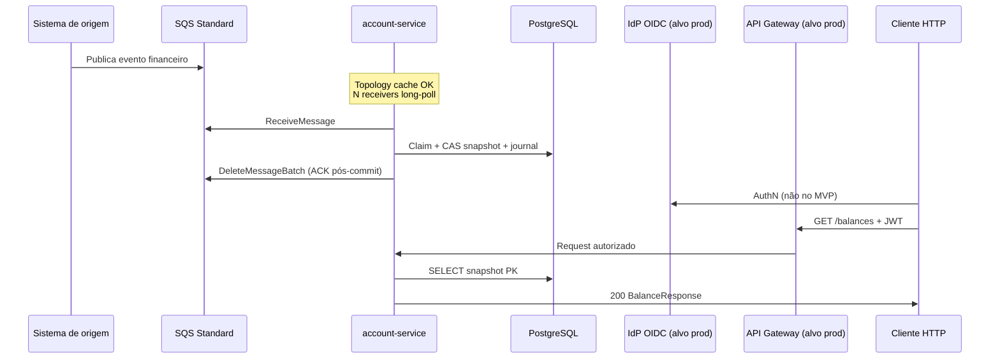
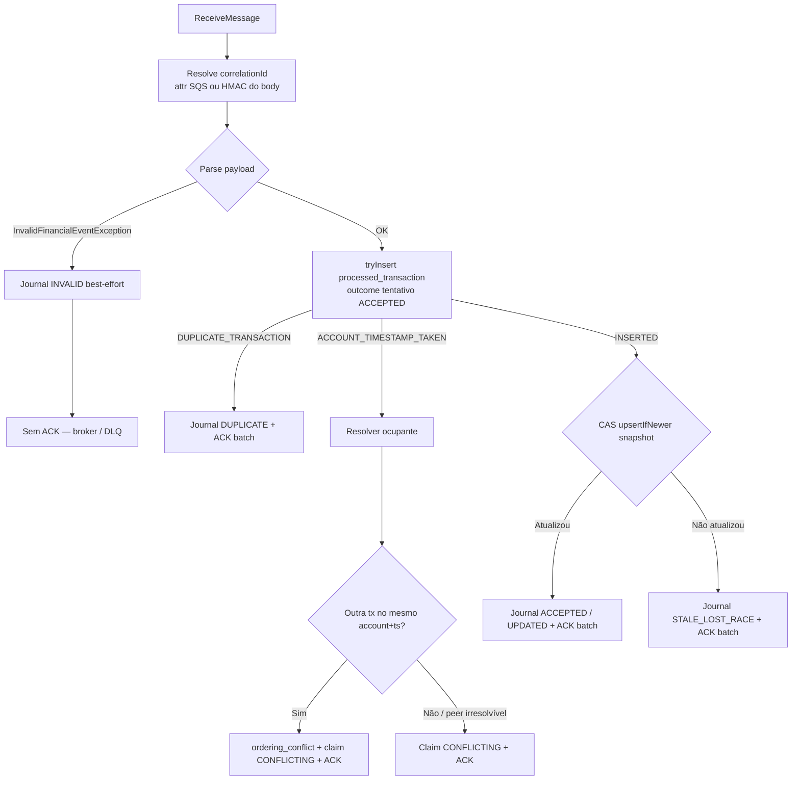
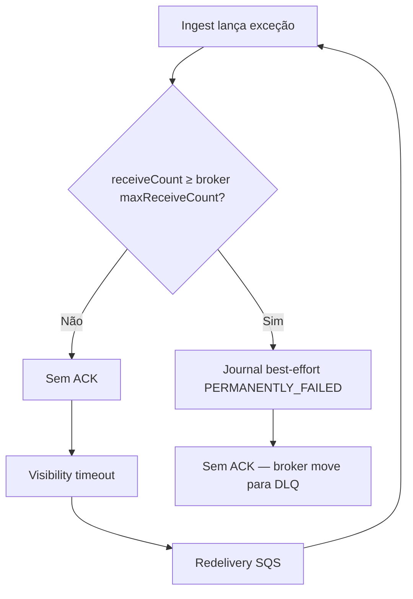
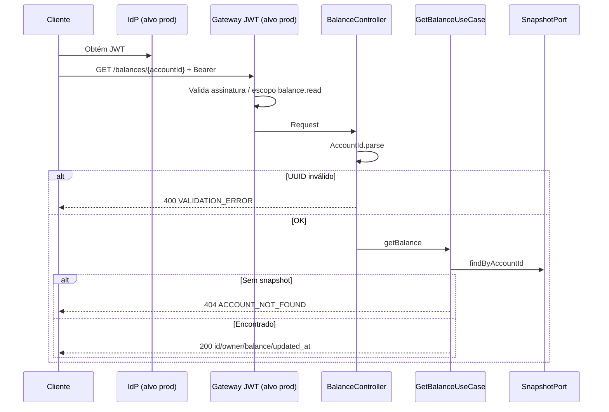
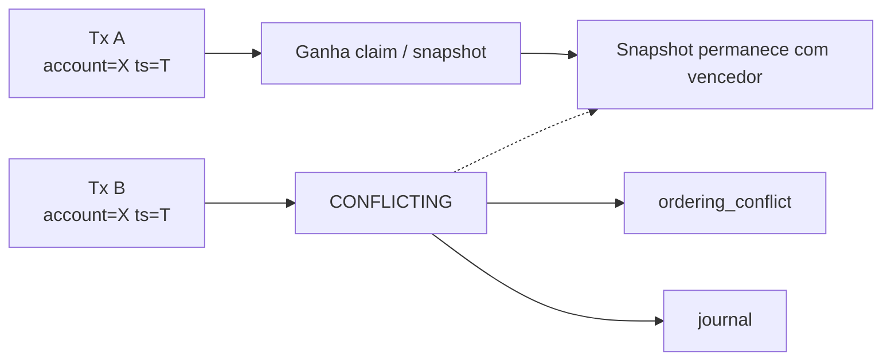
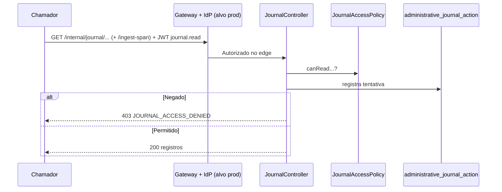
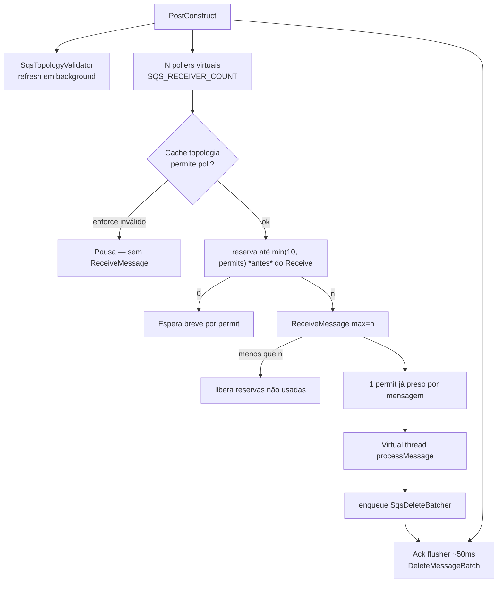

# Fluxos principais

Workflows centrais do account-service. Decisões e motivações: [Design Doc](design-doc.md). Topologia e CI/CD: [Arquitetura AWS](arquitetura-aws-e-pipeline.md).

**Última atualização:** 2026-08-05 (claim-first ingest, batch ACK, topologia em cache, correlação de envelope, escala multi-réplica).

---

## 1. Visão ponta a ponta



No MVP local o hop IdP/Gateway é omitido; a solução-alvo **exige** AuthN/AuthZ — ver design-doc §3.1.

---

## 2. Ingestão de evento (claim-first)

Caminho quente evita lookups: tenta inserir `processed_transaction` primeiro.



**Regras:**

- Saldo do evento é autoritativo (não há soma de lançamentos).
- Vitória = `source_timestamp` estritamente mais novo no CAS.
- ACK = `DeleteMessageBatch` apenas após persistência durável (`ACCEPTED` / `DUPLICATE` / `STALE` / `CONFLICTING`).
- `INVALID` **não** dá ACK — isolamento pelo `RedrivePolicy`.
- Índice `idx_processed_account_ts_lookup` (Flyway V4) acelera `findOtherTransactionAt` no ramo de conflito.

---

## 3. Falha transitória e esgotamento de retry



**Notas:**

- Parse inválido → `InvalidFinancialEventException` → journal `INVALID` best-effort, **sem ACK**.
- `IllegalArgumentException` de lógica interna permanece **retentável**.
- DLQ de broker = isolamento técnico; journal = auditoria. Ver [Design Doc §3.2](design-doc.md).
- Redrive operacional: IAM de recovery **fora** do pod (`deploy/scripts/`, `deploy/terraform/`).

---

## 4. Consulta de saldo



A consulta **não** lê journal nem reconstrói histórico. Latência medida em `http.server.requests` (p95/p99 do desafio).

---

## 5. Conflito de timestamp igual



Não há desempate por ordem de chegada. Recuperação operacional: processo futuro com replay autenticado (IdP + papel `journal.replay`).

---

## 6. Journal interno (acesso negado por padrão)



Replay (`POST /internal/journal/replay`): audita, exige permissão e, no estado atual, responde *não implementado* se permitido.

---

## 7. Concorrência do consumer SQS



- Permits são reservados **antes** de `ReceiveMessage` para vários receivers não super-receberem e devolverem com visibility 0 (isso incrementaria `ApproximateReceiveCount` e poderia ir para a DLQ).
- Se o SQS devolver menos mensagens que o reservado, as reservas ociosas são liberadas imediatamente.
- Validação de DLQ/`maxReceiveCount` **não** está no hot path (cache + health `sqsTopology`).
- Vários pods competem na mesma fila Standard (escala horizontal — [§7.1 do design-doc](design-doc.md)).

---

## 8. Outcomes × efeito no snapshot

| Outcome | Snapshot | ACK? |
| --- | --- | --- |
| `ACCEPTED` | Pode atualizar (`UPDATED`) | Sim (batch) |
| `DUPLICATE` | Inalterado | Sim |
| `STALE` | Inalterado | Sim |
| `CONFLICTING` | Inalterado | Sim |
| `INVALID` | Inalterado | **Não** (DLQ) |
| `PERMANENTLY_FAILED` | Inalterado | **Não** (DLQ) |

Sob carga paralela é esperado misturar `ACCEPTED` e `STALE` (eventos mais antigos perdem o CAS). O saldo final deve coincidir com o evento de **maior** `source_timestamp` por conta (oracle do `deploy/perf`).

---

## 9. Harness de performance

```mermaid
sequenceDiagram
  participant P as run-benchmark.sh
  participant Q as SQS
  participant A as account-service
  participant PG as PostgreSQL
  participant K as k6

  P->>Q: Purge fonte + DLQ
  P->>Q: Seed idx=1 DelaySeconds=0
  A->>Q: Consome seed
  P->>P: Verify 200 / amount=1.00
  P->>Q: Main idx=2..N DelaySeconds=D
  Note over Q: delayed ≈ N — consumer não vê
  P->>P: Espera publish_end + D e delayed=0
  P->>K: Start k6 (SC-003 overlap)
  A->>Q: Consome backlog
  K->>A: GET /balances (simultâneo)
  P->>P: Drain visible+inflight+delayed=0
  P->>P: T1 scrape p95/p99 (gate SC-003)
  P->>PG: MIN/MAX first_processed_at → EPS durável
  P->>P: Wait k6; T2 observacional
  P->>P: Verify oracle final
```

- EPS preferido: `COUNT / (MAX(first_processed_at) − MIN(first_processed_at))` nas contas do run após `T_consume`.
- Publisher msg/s **não** entra no gate.
- Âncora local de sizing: drain **300k** em **16 min 41 s** ⇒ **~300 EPS**/instância; piso para 2k EPS = **7** réplicas (`ceil(2000/300)`). Ainda não prova EKS/RDS. Detalhe: [arquitetura §5](arquitetura-aws-e-pipeline.md)

---

## 10. Referências

- [Modelo de dados](modelo-de-dados.md)
- [Design Doc](design-doc.md)
- [Arquitetura AWS e pipeline](arquitetura-aws-e-pipeline.md)
- [OpenAPI saldo](../src/main/resources/static/openapi-balances.yaml)
