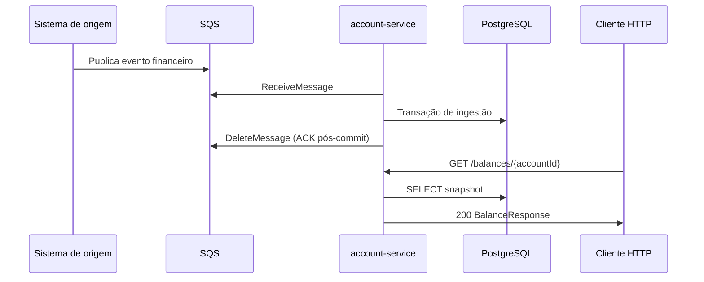
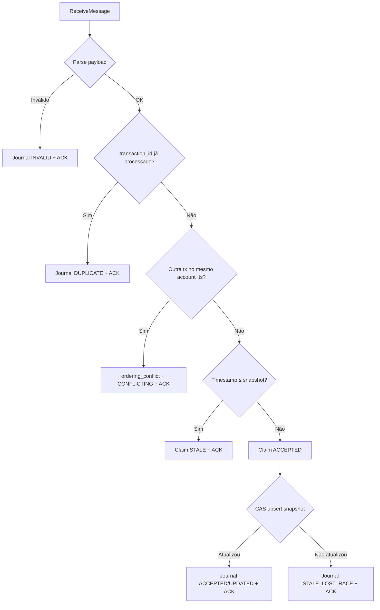
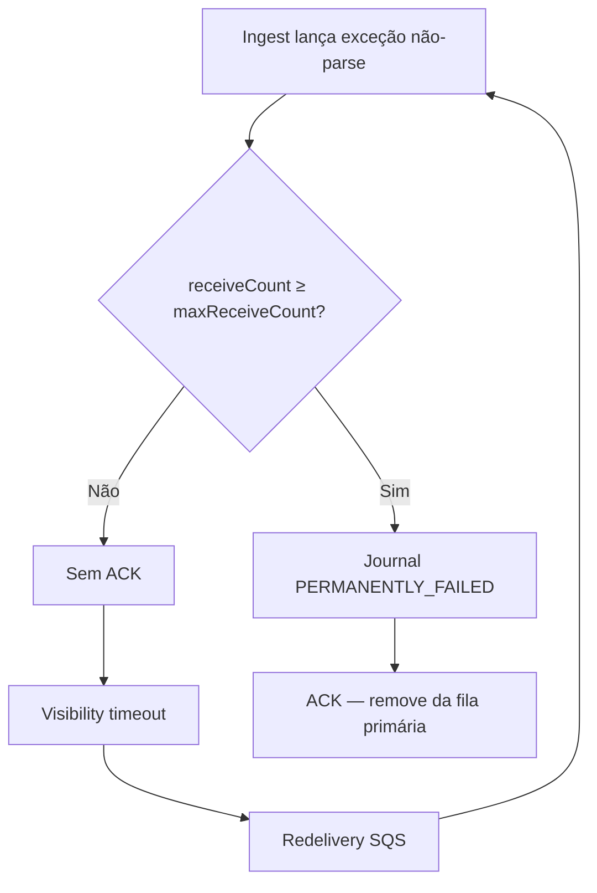
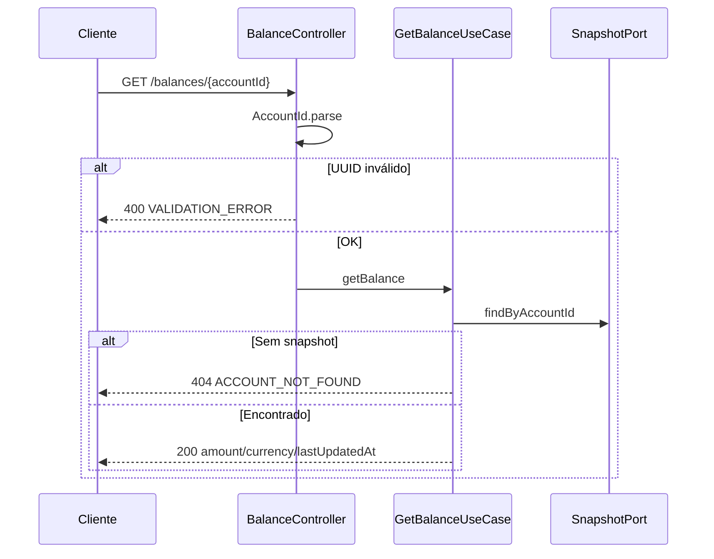
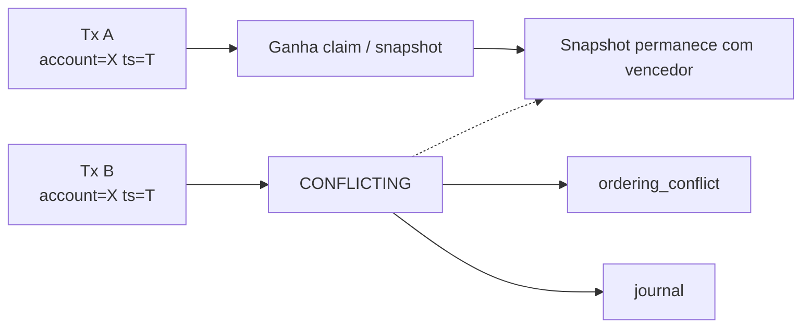
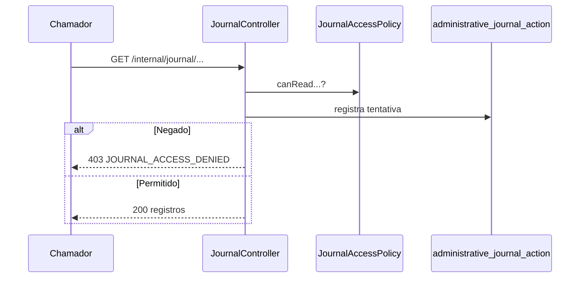
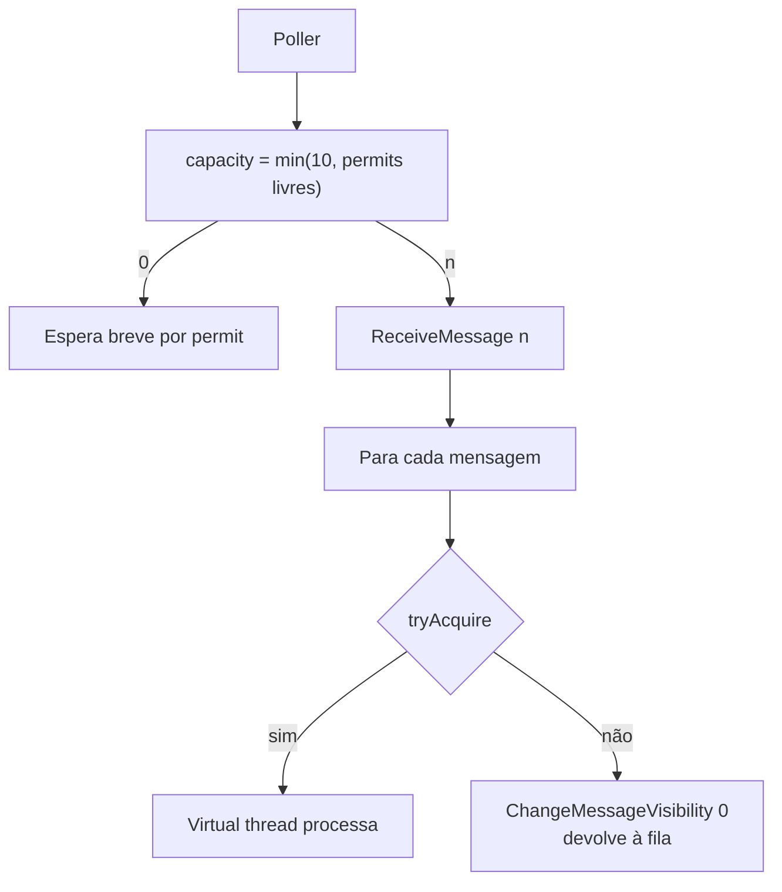

# Fluxos principais

Este documento descreve os workflows centrais do account-service com diagramas. Detalhes de decisão: [Design Doc](design-doc.md).

---

## 1. Visão ponta a ponta

---

## 2. Ingestão de evento (caminho feliz)

**Regras:**

- Saldo do evento é autoritativo (não há soma de lançamentos).
- Vitória = `source_timestamp` estritamente mais novo no CAS.
- ACK = `DeleteMessage` apenas após persistência durável.

---

## 3. Falha transitória e esgotamento de retry

**Notas:**

- Parse inválido usa `InvalidFinancialEventException` → isolamento imediato (não mistura com bugs internos).
- `IllegalArgumentException` de lógica interna permanece **retentável** (não ACK como inválido).
- Sem DLQ de broker neste escopo; quarantine = journal Postgres ([Design Doc §3.2](design-doc.md)).

---

## 4. Consulta de saldo

A consulta **não** lê journal nem reconstrói histórico.

---

## 5. Conflito de timestamp igual

Não há desempate por ordem de chegada. Recuperação operacional fica para processo futuro (replay autenticado).

---

## 6. Journal interno (acesso negado por padrão)

Replay (`POST /internal/journal/replay`): audita, exige permissão e, no estado atual, responde *não implementado* se permitido — ver não-objetivos de auth no [Design Doc](design-doc.md).

---

## 7. Concorrência do consumer SQS

Evita mensagens recebidas sem worker ficarem invisíveis até o fim do *visibility timeout*.

---

## 8. Outcomes × efeito no snapshot

| Outcome | Snapshot |
|---------|----------|
| `ACCEPTED` | Pode atualizar (`UPDATED`) |
| `DUPLICATE` | Inalterado |
| `STALE` | Inalterado |
| `CONFLICTING` | Inalterado |
| `INVALID` / `PERMANENTLY_FAILED` | Inalterado |

---

## 9. Referências

- [Modelo de dados](modelo-de-dados.md)
- [ADR-002](../specs/001-account-balance-query/adr/ADR-002.md) — CAS latest-wins
- [ADR-005](../specs/001-account-balance-query/adr/ADR-005.md) — ACK/retry
- [Contrato SQS](../specs/001-account-balance-query/contracts/sqs-ingestion.md)
- [OpenAPI saldo](../src/main/resources/static/openapi-balances.yaml)
