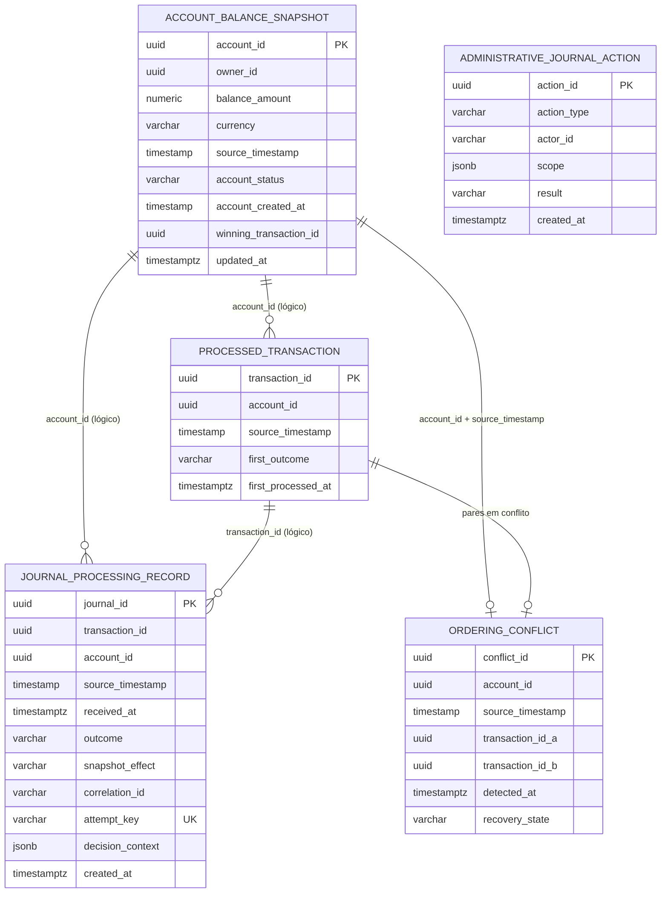

# Modelo de dados

**Escopo:** schema PostgreSQL do account-service (Flyway V1–V4).  
**Dialeto:** PostgreSQL 16.

---

## 1. Visão geral

O modelo separa quatro preocupações:

| Preocupação | Tabela |
|-------------|--------|
| Saldo corrente consultável | `account_balance_snapshot` |
| Idempotência / claim de ordenação | `processed_transaction` |
| Auditoria por tentativa de processamento | `journal_processing_record` |
| Conflitos de timestamp igual | `ordering_conflict` |
| Auditoria de acesso administrativo ao journal | `administrative_journal_action` |

A consulta HTTP **só** lê `account_balance_snapshot`. O journal **não** reconstrói saldo.

---

## 2. DER (Diagrama Entidade-Relacionamento)

Relações lógicas (nem todas são FKs físicas — UUIDs referenciam entidades de domínio/evento):



---

## 3. Tabelas e restrições

### 3.1 `account_balance_snapshot`

Snapshot **mais recente aceito** por conta.

| Coluna | Tipo | Notas |
|--------|------|-------|
| `account_id` | UUID PK | Identidade da conta |
| `owner_id` | UUID | Titular |
| `balance_amount` | NUMERIC(20,4) | Saldo autoritativo |
| `currency` | VARCHAR(3) | ISO 4217; CHECK `^[A-Z]{3}$` |
| `source_timestamp` | TIMESTAMP(6) | Timestamp do evento vencedor |
| `account_status` | VARCHAR(32) | Ex.: ENABLED |
| `account_created_at` | TIMESTAMP(6) | Opcional |
| `winning_transaction_id` | UUID | Tx que ganhou o snapshot |
| `updated_at` | TIMESTAMPTZ | Atualização física da linha |

**Escrita:** upsert CAS — só atualiza se o novo `source_timestamp` for **estritamente maior**.

### 3.2 `processed_transaction`

Registro imutável da **primeira** decisão por `transaction_id`.

| Coluna | Tipo | Notas |
|--------|------|-------|
| `transaction_id` | UUID PK | Idempotência |
| `account_id` | UUID | Conta do evento |
| `source_timestamp` | TIMESTAMP(6) | Chave de ordenação |
| `first_outcome` | VARCHAR(32) | ACCEPTED, DUPLICATE, STALE, CONFLICTING, … |
| `first_processed_at` | TIMESTAMPTZ | Momento do claim |

**Índice único parcial (V3):**

```sql
CREATE UNIQUE INDEX uq_processed_account_source_ts
    ON processed_transaction (account_id, source_timestamp)
    WHERE first_outcome NOT IN ('CONFLICTING', 'INVALID');
```

Garante no máximo um “dono” não-conflitante por `(conta, timestamp)`. Linhas `CONFLICTING`/`INVALID` podem coexistir no mesmo carimbo de tempo.

**Índice de lookup (V4):** `idx_processed_account_ts_lookup (account_id, source_timestamp, first_processed_at) INCLUDE (transaction_id, first_outcome)` — o único parcial **não** serve `findOtherTransactionAt` (predicado diferente). Usado no ramo de conflito do ingest claim-first.

### 3.3 `journal_processing_record`

Uma linha por **tentativa** (`attempt_key` = `messageId:receiveCount`).

| Coluna | Tipo | Notas |
|--------|------|-------|
| `journal_id` | UUID PK | |
| `transaction_id` / `account_id` | UUID | Podem ser nulos em inválidos |
| `source_timestamp` | TIMESTAMP(6) | |
| `received_at` | TIMESTAMPTZ | Recepção no consumidor |
| `outcome` / `snapshot_effect` | VARCHAR | Decisão e efeito no snapshot |
| `correlation_id` | VARCHAR(128) | Rastreio |
| `attempt_key` | VARCHAR(128) **UNIQUE** | Idempotência de journal sob reentrega |
| `decision_context` | JSONB | Motivo (`reasonCode`, etc.) |
| `created_at` | TIMESTAMPTZ | |

Insert com `ON CONFLICT (attempt_key) DO NOTHING` evita falha em reentrega após commit ambíguo.

### 3.4 `ordering_conflict`

Metadados de conflito equal-timestamp.

| Coluna | Tipo | Notas |
|--------|------|-------|
| `conflict_id` | UUID PK | |
| `account_id` + `source_timestamp` | **UNIQUE** | Um registro aberto por chave de ordenação |
| `transaction_id_a` / `_b` | UUID | Par em disputa |
| `detected_at` | TIMESTAMPTZ | |
| `recovery_state` | VARCHAR(32) | Ex.: OPEN |

### 3.5 `administrative_journal_action`

Auditoria de tentativas de leitura/replay do journal (política *deny-by-default*), incluindo `JOURNAL_INGEST_SPAN`.

---

## 4. Outcomes relevantes

| Outcome | Significado para o modelo |
|---------|---------------------------|
| `ACCEPTED` | Claim + possível update do snapshot |
| `DUPLICATE` | `transaction_id` já existia |
| `STALE` | Timestamp ≤ snapshot atual (ou perdeu CAS) |
| `CONFLICTING` | Empate de timestamp com outra tx |
| `INVALID` | Payload inválido journalizado (best-effort); envelope fica para DLQ do broker |
| `PERMANENTLY_FAILED` | Observação de limiar de receive (best-effort); **não** implica DeleteMessage — DLQ é a cópia recuperável |

O journal **não** armazena o body bruto da mensagem SQS; a DLQ preserva o envelope para investigação/recovery.

---

## 5. Evolução do schema (Flyway)

| Versão | Mudança |
|--------|---------|
| V1 | Tabelas núcleo |
| V2 | `currency` CHAR(3) → VARCHAR(3) (alinhamento JPA) |
| V3 | Demote de duplicatas históricas + índice único parcial |
| V4 | Índice de lookup `(account_id, source_timestamp)` para conflito/ocupante |

Arquivos: `src/main/resources/db/migration/`.

---

## 6. Referências

- [Design Doc](design-doc.md)
- [data-model.md (spec)](../specs/001-account-balance-query/data-model.md)
